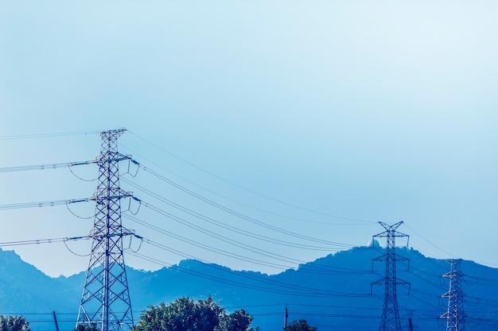
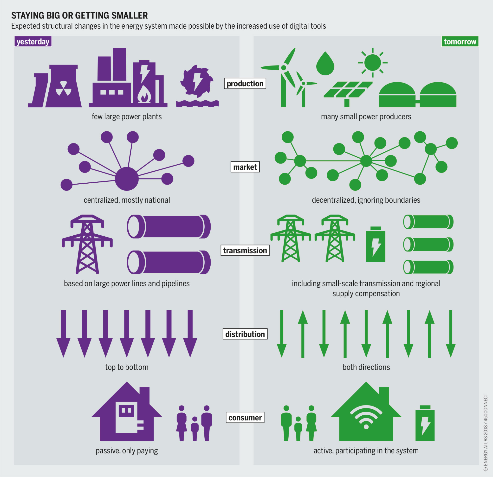
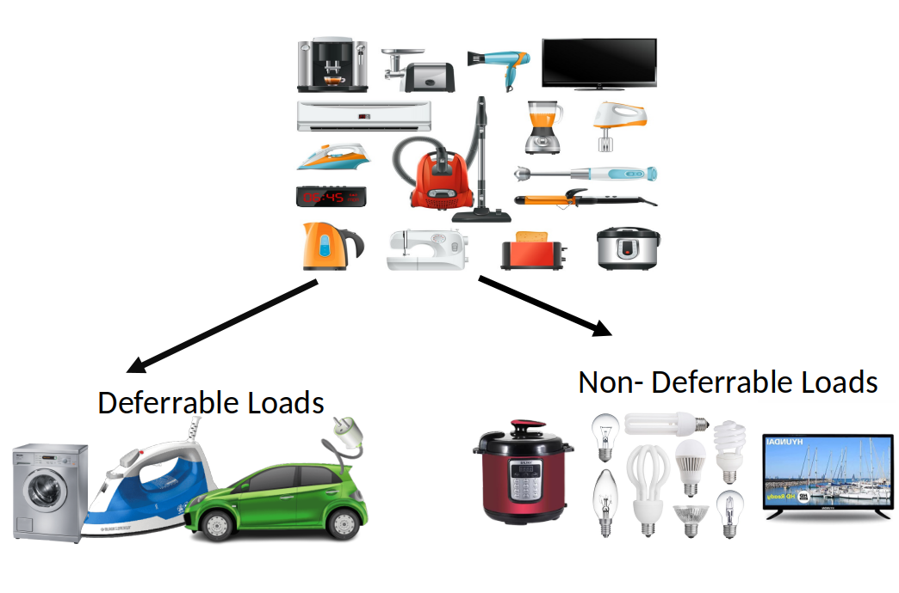

# Predictive Load Management Using Advanced Data Analytics 
 
  - [Introduction](#introduction)
  - [Problem Statements](#problem-statements)
    - [Increasing Energy Demand](#increasing-energy-demand)
    - [Infrastructure Limit](#infrastructure-limit)
    - [Uneven Demand](#uneven-demand)
    - [Inaccurate/No Historical Data](#inaccurateno-historical-data)
  - [Concept of Smart Grid](#concept-of-smart-grid)
  - [Predictive Load Management Device (PLMD)](#predictive-load-management-device-plmd)
  - [Decentralized Demand Flattening](#decentralized-demand-flattening)
  - [Load Categorization](#load-categorization)
  - [Dynamic Tariff Structure](#dynamic-tariff-structure)
  - [Advantages](#advantages)
  - [Conclusion](#conclusion)
  - [Prediction Demo](#prediction-demo)
  - [Load Scheduling](#load-scheduling)
  - [What Does PLMD Do?](#what-does-plmd-do)
  - [How Energy Demand is Predicted](#how-energy-demand-is-predicted)
- [References](#references)
- [Training History](#training-history)
- [RNN Network Architecture](#rnn-network-architecture)

### Introduction

**Demand Side Management:**

- Manage the demand for electricity in the power grid.
- Aims to optimize the use of electricity, reduce peak demand, and improve the overall efficiency of the power system.
- Helps to reduce the need for new power plants and other infrastructure.
 

### Problem Statements

#### Increasing Energy Demand

- High demand in winter season and peak hours.
- Importing electricity from neighboring countries.
- If unable to fulfill the demand then load shedding and blackouts.

---

#### Infrastructure Limit

- Lack of water reservoir which leads to importing electricity in peak hours (which is expensive).
- Lack of two-way communication between utility and consumer.

---

#### Uneven Demand

- Energy consumption is less in off-peak hours (Peak/average ratio is less).
- Consumers consume more electricity during morning and evening times of the day.

---

#### Inaccurate/No Historical Data

- Accurate and comprehensive data on past electricity consumption patterns is crucial for understanding current demand patterns and forecasting future demand.

---

### Concept of Smart Grid

- All the renewable sources to the grid.
- Real-Time Monitoring.
- BEM using various DSM techniques.
- Incentivizing Consumers.

---

### Predictive Load Management Device (PLMD)

- Real-time energy consumption.
- Future demand prediction.
- Renewable integration during peak hours.
- Load scheduling and tariffs development.
- Dataset generation.

---

**Hardware**

  
  

### Decentralized Demand Flattening

    
    

 

---

### Load Categorization

 

---

### Dynamic Tariff Structure

 

---

### Advantages

- Helps to ensure the availability of enough capacity to meet tomorrow’s demand.

    
    

- Automatic integration of renewable energy sources (if available).

     

 

---

- Hides the complexity of DSM from the users and creates a user-friendly interface.

     

 

- Utilizes the leftover inverter batteries bought during the previous blackout and automates it.

    
    

---
 
### Conclusion

- Demand Prediction
- Deferrable Load Scheduling
- Automatic Renewable Integration
- Eliminates DSM complexity from user

### Prediction Demo

https://user-images.githubusercontent.com/70265297/211731263-cf6aa78a-02fa-447f-be15-22387b881e76.mp4

### Load Scheduling

---

### What Does PLMD Do?

- Regularly monitors the real-time energy usage and cloud storing.
- Automatic PV Switching based on peak hours.
- Peak load management, improved QoS, and reliability.
- Simple and user-friendly IoT interface.
- Used as basic energy meter.

### How Energy Demand is Predicted

- Energy consumption pattern is different for different people but is affected by factors such as:
  - Weather condition
  - Holiday
  - Past consumption pattern
  - Festivals

  
  
  

---

## References

- Abdul Hafeez Abid and Ammar Hasan. An approach for demand side management of non-flexible load in academic buildings, IEEE, 2018.
- Isaiah Adediji Adejumobi and Joseph Adesina Adeoti. Efficient utilization of industrial power: demand side management approach, IEEE, 2019.
- SP Anjana and TS Angel. Intelligent demand side management for residential users in a smart micro-grid, IEEE, 2017.
- Wan He. Load forecasting via deep neural networks. Procedia Computer Science, 122:308–314, 2017.
- K Maharaja, P Pradeep Balaji, S Sangeetha, and M Elakkiya. Development of bidirectional net meter in grid connected Solar PV system for domestic consumers. In 2016 International Conference on Energy Efficient Technologies for Sustainability (ICEETS), pages 46–49. IEEE, 2016.
- Asha Radhakrishnan and MP Selvan. Load scheduling for smart energy management in residential buildings with renewable sources. In 2014 Eighteenth National Power Systems Conference (NPSC), pages 1–6. IEEE, 2014.
- Judith Stute and Matthias Kühnbach. Dynamic pricing and the flexible consumer–investigating grid and financial implications, 2023.

---

## Training History

## RNN Network Architecture

 

 
